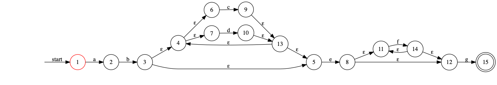

一个非常简单的正则引擎
====================

语法分析表
----------


 ``parsing_table.py``，从上下文无关文法构建规范LR(1)语法分析表。

    grammar = ...
    
    state_map = ...
    
    
非确定有限自动机(NFA)
-------------------

``graph.py``，实现了NFA和它的状态图展示，以及匹配算法。


正则表达式的基本推导
------------------

``regex_nfa.py``，实现了正则表达式规则到状态图的基本推导规则。


生成正则表达式的nfa
-------------------

``compiler.py``，编译生成样式的nfa。在SDT语法制导中将regex_pattern转换成生成函数字符串，
再对结果求值，得到nfa。

Usage
------

```python
from regex import regex_compile
nfa = regex_compile("ab(c|d)*ef*g")
nfa.show()
```
    


    nfa.match("abdcdcefffg")
   
```   
Out[]: True
```

可接受的正则语法
---------------
- 产生式：
    1. Kleen Expression,  A -> a*
    2. or表达式，          A -> a|b
    3. 连接表达式，        A -> aa
    4. 括号，             A -> (a)
- 终结符号：
    1. string.ascii_letters, 大小写字符
    2. string.digits，数字
    3. 除了"()|*$"以外的标点符号
    4. 转义字符"\\("，"\\)"，"\\|"， "\\*", "\\$"
    
Example:

```python
s = "a(b)*(a|b)cc((k(b|c)*v)|zz)"   # correct
s = "(a|b)*a"                       # correct
s = "a|b*"                          # correct
s = "a|(b|c)*ac"                    # correct
m = regex_compile(s)

"a|b)"                              # illegal
"a(c"                               # illegal

m.match("ac,ak")                    # correct
m.match("a>,ak")                    # correct
m.match("ab)")                      # illegal
m.match("a*kk")                     # illegal

s = "\(\)\|\*\$")                   # correct
m = regex_compile(s)
m.match("()|*$")                 
Out[]: True
```    

